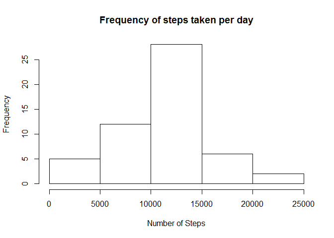
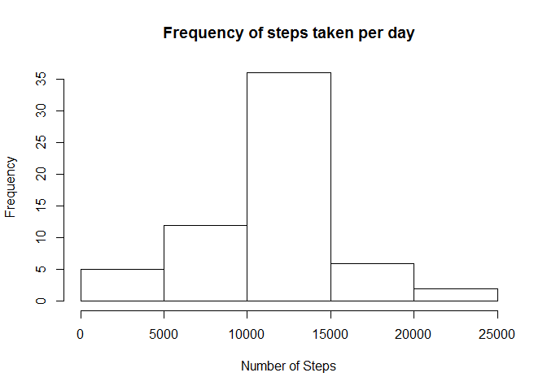
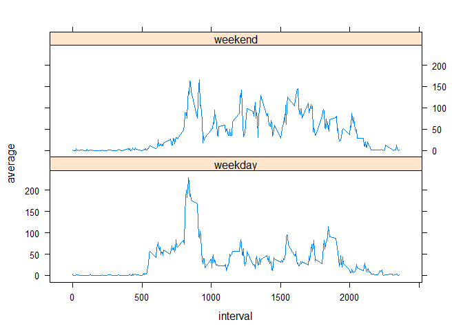

# Reproducible Research: Peer Assessment 1


## Loading and preprocessing the data


```r
temp <- tempfile()
download.file("http://d396qusza40orc.cloudfront.net/repdata%2Fdata%2Factivity.zip",temp)
activity <- read.csv(unz(temp, "activity.csv"), stringsAsFactors=FALSE)
unlink(temp)

activity$date <- as.POSIXct(activity$date, format="%Y-%m-%d")
```


## What is mean total number of steps taken per day?


```r
suppressWarnings(library(plyr))

dailySteps <- ddply(activity, "date", summarise, count=sum(steps,na.omit=TRUE))

hist(dailySteps$count, xlab="Number of Steps", main="Frequency of steps taken per day")
```

 

```r
mean(dailySteps$count, na.rm=TRUE)
```

```
## [1] 10767.19
```

```r
median(dailySteps$count, na.rm=TRUE)
```

```
## [1] 10766
```

## What is the average daily activity pattern?


```r
dailyPattern <- ddply(activity, "interval", summarise, average=mean(steps,na.rm=TRUE))

plot(dailyPattern$interval, dailyPattern$average, type="l", xlab="Interval", ylab="Average number of steps", main="Average number of steps per interval")
```

 

The 5-minute interval with the maximum number of steps:  


```r
dailyPattern$interval[which.max(dailyPattern$average)]
```

```
## [1] 835
```


## Imputing missing values

The total number of rows with NAs is:  


```r
sum(is.na(activity$steps==TRUE))
```

```
## [1] 2304
```

Using the average number of steps per interval to replace NAs:  


```r
# Create new dataset that includes the average number of steps per interval
activityFixed <- merge(activity, dailyPattern, by.x="interval", by.y="interval")

# For each NA on the 'steps' column, insert the average for that interval (average column from the dailyPattern dataset)
activityFixed$steps[is.na(activityFixed$steps)] <- activityFixed$average[is.na(activityFixed$steps)]

# Remove the 'average' column (not needed anymore)
activityFixed$average <- NULL

dailyStepsFixed <- ddply(activityFixed, "date", summarise, count=sum(steps,na.omit=TRUE))

hist(dailyStepsFixed$count, xlab="Number of Steps", main="Frequency of steps taken per day")
```

 

```r
mean(dailyStepsFixed$count, na.rm=TRUE)
```

```
## [1] 10767.19
```

```r
median(dailyStepsFixed$count, na.rm=TRUE)
```

```
## [1] 10767.19
```

## Are there differences in activity patterns between weekdays and weekends?


```r
activityFixed$daytype <- ifelse(weekdays(activityFixed$date)=="Sunday" | weekdays(activityFixed$date)=="Saturday","weekend","weekday")
activityFixed <- activityFixed[order(activityFixed$date),]
activityFixed$daytype <- as.factor(activityFixed$daytype)

dailyPatternFixed <- ddply(activityFixed, .(interval,daytype), summarise, average=mean(steps,na.rm=TRUE))

library(lattice)

xyplot(average ~ interval | daytype, data = dailyPatternFixed, type="l", layout=c(1,2))
```

 
